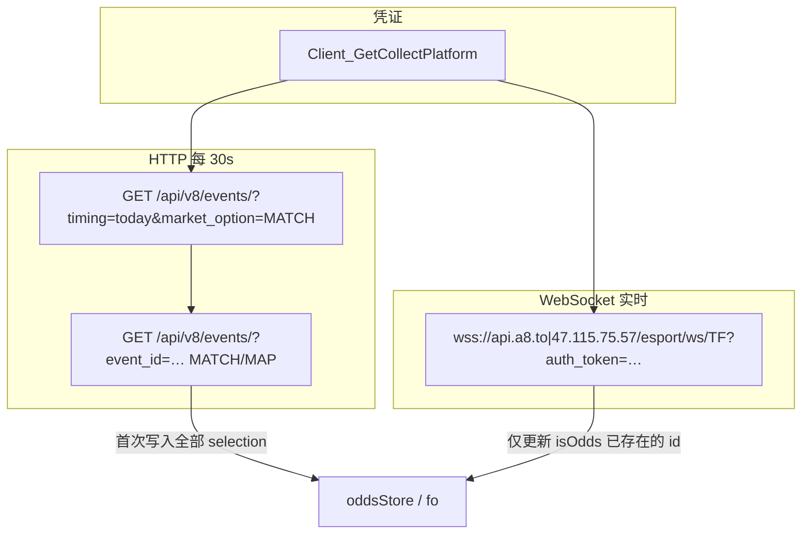

# TF 平台逻辑 parity：A8 bundle ↔ changmen

真源：`A8/A8frontendscipts/2.0.1/index.js`（`Uf=Xt.TF`、`UBe` 采集、`WBe`/`$3`/`LBe` 鉴权、`bYe` 下注、`ly`/`uy` 账号 HTTP）。

验收：同一 A8 账号（如 `TJ01`）下，采集凭证、HTTP/WS 路径、请求头分工、轮询间隔与下注分支与 A8 一致。

| # | 能力 | A8 符号 | changmen 路径 | 状态 |
|---|------|---------|---------------|------|
| 1 | 采集凭证 | `Vt.getPlatform(TF)` | `api/esport` → `getCollectPlatform("TF")`；后端 `getTfA8CollectCredentials()` | 已实现 |
| 2 | A8 esport 请求体 | `_r.post` form-urlencoded | `shared/a8_esport_client.js` `postEsport` | 已实现 |
| 3 | A8 登录 | v4 `user/account/login` + header `token` | `a8_esport_client.loginEsport` 回退 `loginV4` | 已实现 |
| 4 | 比赛列表 30s | `UBe` → `o()` | `collectors/tf/index.ts` `TF_POLL_MS=30000` | 已实现 |
| 5 | 单场详情 1s | `UBe` → `a(eventId, tab)` | `TF_STAGE_WAIT_MS=1000` + `loadTfBets` | 已实现 |
| 6 | HTTP 头 `$3` | `$3(token)` | `shared/platforms/tfAuth.ts` `tfRequestHeaders` | 已实现 |
| 7 | 赔率 WS | `FBe`/`WBe` | `collectors/tf/ws.ts` → `relayWsUrl(/esport/ws/TF)` | 已实现 |
| 8 | WS 仅更新已注册盘 | `e.isOdds(TF, id)` | `oddsStore.isOdds` 同上 | 已实现 |
| 9 | 锁盘 `status !== "open"` | `Xn(..., isLock)` | `sel.status !== "open"` | 已实现 |
| 10 | HTTP 详情写全部 selection | `g.selection.forEach` | `ingestResults` 遍历 selection | 已实现 |
| 11 | 余额 | `bYe.getBalance` | `providers/tfProvider.ts` | 已实现 |
| 12 | 预检 checkBet | `bYe.checkBet` 11.00 / -0.05 | 同左 + `forceDirect` | 已实现 |
| 13 | 下单 | `bYe.betting` status 201 | 同左 | 已实现 |
| 14 | 订单 | `bYe.getOrders` transactions | `getOrders` + `signed: true` | 已实现 |
| 15 | 下注 HTTP 头 `ly` | 无 `tf-authorization` | `buildTfAccountHeaders` 默认 | 已实现 |
| 16 | 订单 HTTP 头 `ly(,true)` | 合并 `$3` | `accountTfGet(..., { signed: true })` | 已实现 |
| 17 | transactions 走 api-v4 | `uy` replace `api.` | `tfGatewayUrl` | 已实现 |

---

## 1. 凭证从哪里来

### 1.1 A8 前端流程

```text
用户登录 A8
  → localStorage["token"] = esport 会话（多数环境来自 v4 login 的 token）
  → Vt.getPlatform("TF")
       POST https://api.a8.to/esport/Client_GetCollectPlatform  { provider: "TF" }
       POST https://api.a8.to/esport/Client_GetGames           { provider: "TF" }
  → 返回 { gateway, token, betName, games }
```

`getPlatform` 实现（bundle 摘要）：

```javascript
getPlatform: async (t) => {
  const r = (await _r.post("Client_GetCollectPlatform", { provider: t })).data;
  if (r.success === 0) return null;
  const n = { gateway: r.info.Gateway, token: r.info.Token, betName: r.info.BetName, games: [] };
  const s = await _r.post("Client_GetGames", { provider: t });
  n.games = s.data.info?.filter((a) => a);
  return n;
}
```

### 1.2 esport API 调用格式（重要）

A8 的 `_r.post` **不是 JSON**，而是：

| 项 | 值 |
|----|-----|
| `Content-Type` | `application/x-www-form-urlencoded` |
| Header | `token: <会话 token>` |
| Body | `provider=TF`（URLSearchParams） |

若用 `application/json` 发 body，A8 可能只返回 `{"success":1,"msg":"0ms"}` **不带 `info`**，导致拿不到 `Gateway`/`Token`。

### 1.3 登录：v4 vs esport Client_Login

| 接口 | 路径 | 说明 |
|------|------|------|
| v4 登录 | `POST https://api.a8.to/v4.0/user/account/login` | `TJ01` 等账号通常**仅此处成功** |
| esport 登录 | `POST …/esport/Client_Login` | 部分账号报「用户名不存在」 |

采集接口的 `token` header 使用 **v4 返回的 token** 即可（已实测可拿到完整 `info`）。

changmen 后端：`shared/a8_esport_client.js` → `loginEsport()` 先尝试 esport `Client_Login`，失败则 `loginV4()`；`shared/tf_a8_collect.js` 缓存 60s。

### 1.4 返回字段含义（实测示例）

账号 `TJ01` / `a123456`（2026-05 拉取，Token 会过期）：

| 字段 | 示例值 | 用途 |
|------|--------|------|
| `Gateway` | `https://api-v4.tf-api-rr3h.com` | TF REST 根地址；WS 经 A8 中继 |
| `Token` | `Token 0002e585…`（长 hex） | `Authorization` + 计算 `tf-authorization` |
| `BetName` | `(独赢)` | 盘口名正则，匹配 `market_name` |
| `games` | `["1","2","3","14","24"]` | 列表过滤 `game_id`；与 `game_catalog.json` 的 TF 列映射 |

本地复现：

```bash
node -e "require('./changmen/gamebet_backend/shared/a8_esport_client.js').fetchCollectPlatformWithGames('TF').then(console.log)"
```

---

## 2. HTTP 请求头：`$3` / `ly` / `uy`

### 2.1 采集 HTTP（`$3`）

```javascript
$3 = (t) => ({
  Authorization: t,
  "tf-authorization": LBe(t, now, now),
  "public-token": "2633b50ad4f64cd28b3224e47c877057",
});
```

| 头 | 来源 |
|----|------|
| `Authorization` | `Client_GetCollectPlatform` 的 `Token`（可带 `Token ` 前缀） |
| `tf-authorization` | **本地算法** `LBe`：Token Base64 作 HMAC 密钥 + 10 秒时间桶 + SHA-512 |
| `public-token` | **前端写死常量**，非接口返回 |

changmen：`shared/platforms/tfAuth.ts`（`buildTfAuthorization`、`tfRequestHeaders`）。

### 2.2 账号下注 HTTP（`ly`）

```javascript
ly = (account, signed) => ({
  authorization: account.token,
  "X-Unique": Date.now(),
  "Content-Type": "application/json",
  // signed === true 时再合并 $3(account.token)
});
```

| 场景 | 是否带 `tf-authorization` |
|------|---------------------------|
| 钱包 `/api/game-client/v8/wallet/` | **否** |
| 预检/下单 `/api/game-client/v8/single-bet/` | **否** |
| 订单 `/api/v8/transactions/` | **是**（`ly(account, true)`） |

### 2.3 Gateway 路径（`uy`）

```javascript
uy = (account, path) => {
  let r = account.gateway;
  if (/transactions/.test(path)) r = r.replace("api.", "api-v4.");
  return `${r}${path}`;
};
```

changmen：`tfGatewayUrl` in `tfAuth.ts`。

---

## 3. 赔率更新：轮询 + WebSocket



### 3.1 HTTP 轮询（`UBe` 内 `o` / `a`）

| 步骤 | 间隔 | URL 要点 |
|------|------|----------|
| 今日列表 | 每轮结束 **30s** | `game_id=&timing=today&market_option=MATCH` |
| 单场 MATCH | 每场前 **1s** | `event_id=&market_option=MATCH` |
| 各 MAP tab | 每个 tab 前 **1s** | `market_option=MAP&map_option=<tab>` |

列表过滤（A8）：

- `game_id` ∈ `games`
- `start_datetime` 开赛时间 &lt; 现在 + **3600s**

详情：匹配 `BetName` 正则的 market，**遍历该 market 下所有 `selection`** 写入 store（HTTP 不检查 `isOdds`）。

Headers：`$3(platform.token)`。

### 3.2 WebSocket（`WBe`）

```javascript
WBe = (gateway, token) => (
  gateway.replace("https://api-v4", "wss://ws"),
  token.replace("Token ", ""),
  `wss://${host}/esport/ws/TF?auth_token=${auth}&combo=false`
);
// host 在 api.a8.to 与 47.115.75.57 间轮换
```

消息处理：

```javascript
onmessage = (i) => {
  const { data } = JSON.parse(i.data);
  const marketId = data.market_id;
  data.selection.forEach((c) => {
    const id = `${marketId}:${c.name}`;
    if (!e.isOdds(TF, id)) return;  // 必须先有 HTTP 种子
    e.save(TF, new Xn(id, c.euro_odds, c.status !== "open", marketId));
  });
};
```

重连：`ReconnectingWebSocket`，`minReconnectionDelay: 1000`，`maxReconnectionDelay: 5000`。

changmen：经本地 **`relayWsUrl(/esport/ws/TF?...)`** 转发（逻辑同 A8，中继 host 为本地后端）。

---

## 4. 赔率 ID 规则

```text
oddsId = `${market_id}:${selection.name}`
```

示例：`home` / `away` 等 selection 名；与 `itemId`、`parseTfItemId` 一致。

---

## 5. 下注（`bYe` / `tfProvider`）

| 步骤 | 方法 | 路径 | 说明 |
|------|------|------|------|
| 余额 | GET | `/api/game-client/v8/wallet/` | `ly(account)` |
| 预检 | POST | `/api/game-client/v8/single-bet/` | 金额 `11.00`，odds `-0.05`；`code===4` 解析欧赔 |
| 下单 | POST | `/api/game-client/v8/single-bet/` | 成功 **HTTP 201**；`code===16`/`member_odds` 更新赔率 |
| 当前单 | GET | `/api/v8/transactions/?transaction_type=current&…` | `ly(account, true)` |
| 历史单 | GET | `/api/v8/transactions/?transaction_type=history&…` | 昨天～今天 |

Ticket body（摘要）：

```json
{
  "amount": "100.00",
  "accept_any_odds": false,
  "tickets": [{
    "market_id": "<betId>",
    "bet_type_selection": "<home|away|…>",
    "odds": "<港赔字符串>",
    "member": { "odds": "<欧赔字符串>", "odds_type": "euro" }
  }]
}
```

---

## 6. changmen 文件对照

| 层级 | 文件 |
|------|------|
| A8 拉凭证 | `gamebet_backend/shared/a8_esport_client.js` |
| TF 缓存 | `gamebet_backend/shared/tf_a8_collect.js` |
| API 路由 | `gamebet_backend/esport-api/router.js`（`Client_GetCollectPlatform` TF 分支） |
| 启动同步 | `gamebet_backend/esport-api/platform_sync.js` `syncTfFromA8` |
| 后端 TF feed | `gamebet_backend/platforms/tf/*` |
| 采集入口 | `gamebet_frontend/.../collectors/tf/index.ts` |
| WS | `collectors/tf/ws.ts` |
| HTTP 采集 | `collectors/tf/http.ts` |
| 鉴权 | `shared/platforms/tfAuth.ts` |
| 下注 | `providers/tfProvider.ts` |
| 账号 HTTP | `shared/platformHttp.ts` `accountTfGet/Post` |
| 游戏 ID | `gamebet_backend/shared/game_catalog.json` → `platforms.TF` |

---

## 7. 配置与排错

| 方式 | 说明 |
|------|------|
| 自动（推荐） | 后端 `A8_USER`/`A8_PASSWORD` 或 `data/esport/a8_config.json` → `getTfA8CollectCredentials()` |
| 环境变量 | `TF_GATEWAY`、`TF_TOKEN`、`TF_BET_NAME` |
| 本地文件 | `data/esport/platforms.json` 的 `TF` 段 |
| 审计脚本 | `node gamebet_backend/scripts/check-collect-platforms.js` |

常见问题：

1. **GetCollectPlatform 无 info**：检查是否用了 JSON body；改为 form-urlencoded。
2. **esport Client_Login 失败**：改用 v4 登录 token 调 esport 接口。
3. **WS 无更新**：HTTP 尚未写入该 `market_id:selection`（`isOdds` 为 false）。
4. **下注 401**：账号 token 与采集 token 不同；下注用粘贴的 TF 场馆账号。

---

## 8. 相关文档

- 采集实现摘要：[`TF.md`](./TF.md)
- 全平台对照：[`A8_COMPARE_ALL_PLATFORMS.md`](./A8_COMPARE_ALL_PLATFORMS.md)
- 后端 TF feed：[`../../../../gamebet_backend/platforms/tf/README.md`](../../../../gamebet_backend/platforms/tf/README.md)
- 项目总览 TF 章节：[`../../../../readme.md`](../../../../readme.md)（§9 TF 平台分析）
